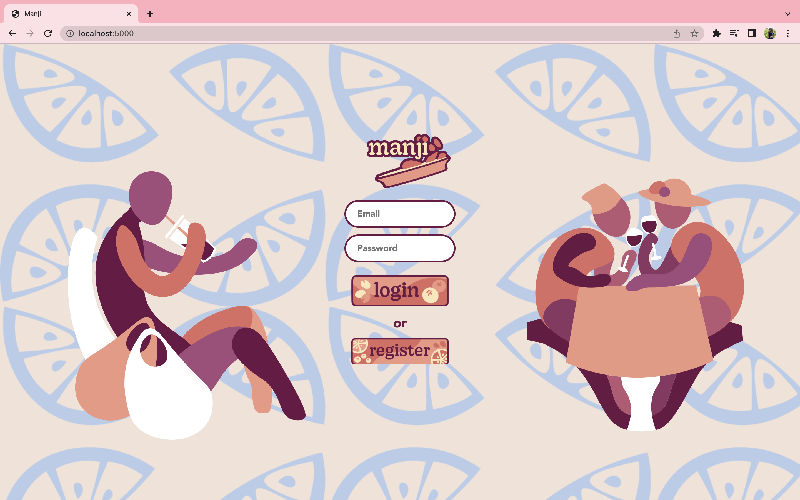

# Manji 



Help narrow down your restaurant choice woes with the Manji App!

Manji is a web application built with React and Flask that allows you to build a list of your favorite restaurants and share that list with others. Users can filter restaurant lists by city, zone into specific locations, and even see what their friends thoughts were on a favorited restaurant. 

Expand your food adventures with Manji. 

### Table of Contents 📖

-[Tech Stack](#tech-stack-💻)
-[APIs](#apis-📚)
-[Features](#features-🪄)
-[Set Up](#set-up-🛠️)
-[About me](#about-me-🧘‍♀️)


### Tech Stack 💻

* Javascript - _React_
* Python - _Flask(2.03)_, _SqlAlchemy(1.4.32)_
* Database - _PostgreSQL_
* Styling - _HTML/CSS_, _Bootstrap 5.0_
### APIs 📚

* [Yelp Fusion API](https://www.yelp.com/developers/documentation/v3/get_started)
* [Google Maps API](https://console.developers.google.com/)
	⋅⋅*Maps JavaScript API
	⋅⋅*Places API

### Features 🪄 
#### [See a full video walkthrough](https://www.youtube.com/watch?v=UilGw6Yc-WI)
**Once a user registers and logs in, they are able to access the following:**

* Navbar - allows the user to add new restaurants, see their profile link, and log out
* Map - a dynamic map that has markers reflecting user restaurants with the ability to search by city and see restaurant info and user comment
* Restaurants List - list of favorited restaurants by user, where you can edit comments, delete favorites
* Friend's List - List of connected friends, where you can click each name to view their favorites and even add to your own list
* Search Page - Use the search page to add new restuarants to your favorites list

### Set Up 🛠️
1. clone repository 
	```
	git clone https://github.com/YolineB/hb-manji
	```
2. create virtualenv and activate it
	```
	virtualenv env
	source env/bin/activate
	```
3. install dependencies
	```
	pip3 install -r requirements.txt
	```
4. sign up for your [Yelp API key](https://www.yelp.com/developers/documentation/v3/get_started) and [GoogleMaps API key](https://console.developers.google.com/)

5. create a `secrets.sh` file and store your Yelp key in the quotes, taking care to not add spaces before and after the equal sign
	```
	export YELP_KEY=”your_yelp_key_here”
	```
6. link your GoogleMaps key by replacing the script tag in homepage.html with your own Google API key
	```
	<script
	src="https://maps.googleapis.com/maps/api/js?key=(your_google_key_here)&libraries=places"
	>
	</script>
	```
7. in your command terminal, source your yelp key within the virtual environment
	```
	source secrets.sh
	```
8. seed the database
	```
	python3 seed_database.py
	```
9. run your server
	```
	python3 server.py
	```
10. navigate to `localhost:5000/` on your web-browser to access Manji

### About Me 🧘‍♀️

Hi! My name is Yoline, and I am excited to share Manji. Manji is my first full-stack web application that I built in 4-weeks while attending Hackbright, a software engineering fellowship.

Let's connect via [Linkedin](https://www.linkedin.com/in/yolineb/)!